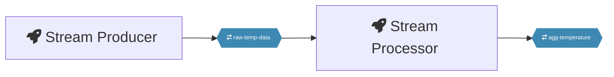

```mermaid
%%{ init: { 'flowchart': { 'curve': 'monotoneX' } } }%%
graph LR;
Stream_Producer[fa:fa-rocket Stream Producer &#8205] --> raw-temp-data{{ fa:fa-arrow-right-arrow-left raw-temp-data &#8205}}:::topic;
raw-temp-data{{ fa:fa-arrow-right-arrow-left raw-temp-data &#8205}}:::topic --> Stream_Processor[fa:fa-rocket Stream Processor &#8205];
Stream_Processor[fa:fa-rocket Stream Processor &#8205] --> agg-temperature{{ fa:fa-arrow-right-arrow-left agg-temperature &#8205}}:::topic;


classDef default font-size:110%;
classDef topic font-size:80%;
classDef topic fill:#3E89B3;
classDef topic stroke:#3E89B3;
classDef topic color:white;
```